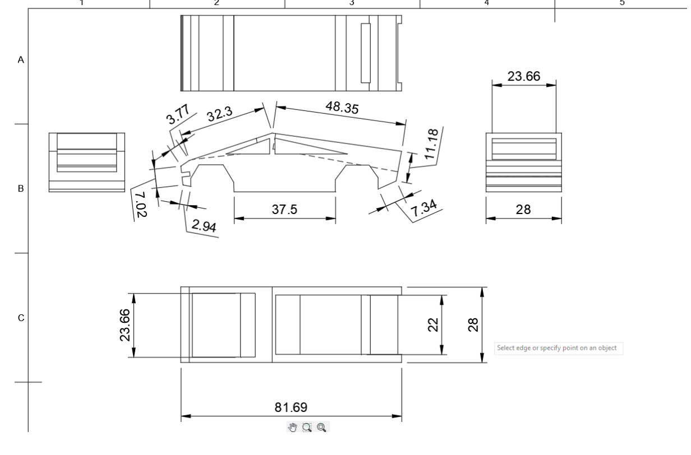

# Mini OpenGL learning project

A rotating cybertruck with a list of features implemented:
- Plane Ground
- Vehicle Parts
- Hierarchical Modelling
- Road Columns
- Textures
- Normals for Lighting
- User Interface

## Linux Setup
'qmake' to generate makefile from  Vehicle.pro

'make' to compile

'./TargetVehicle'(name defined as TARGET in .pro file) to run

Use make clear and remove.bash to cleanup and remove output as well as _moc files
