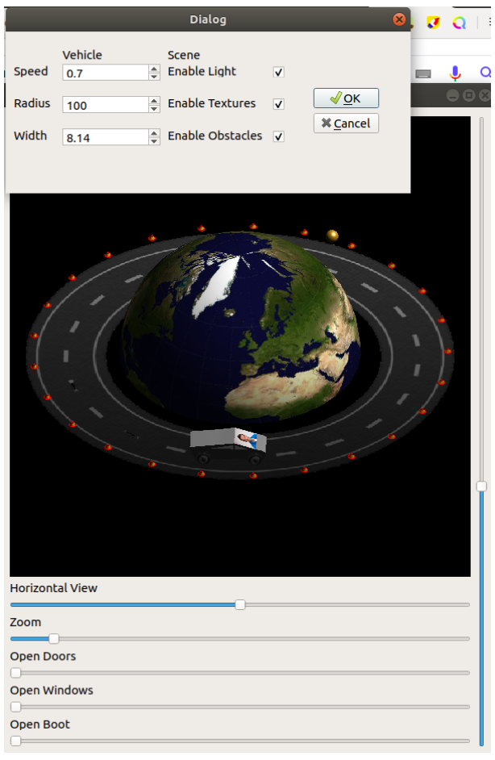

# OpenGl_f
OpenGL Graphics

## Linux Setup
'qmake' to generate makefile from  Vehicle.pro

'make' to compile

'./TargetVehicle'(name defined as TARGET in .pro file) to run

Use make clear and remove.bash to cleanup and remove output as well as _moc files
